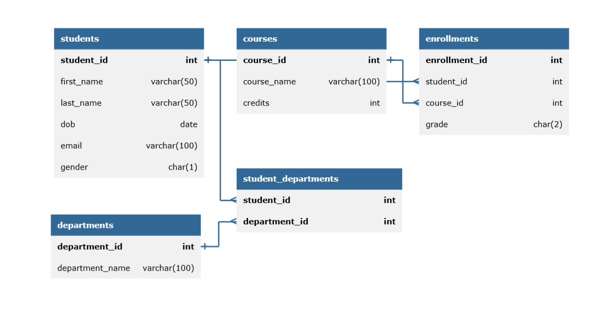

# 🎓 Student Records Database

## 📘 Description
This project is a simple relational database designed to store and manage student records including student personal information, courses, and enrollments.

## 🛠️ How to Setup / Run
1. Open your preferred SQL client (e.g., MySQL Workbench, pgAdmin, or SQLite).
2. Import and run the `student_records.sql` script.
3. The script will create the necessary tables and populate them with sample data.

## 📊 ERD

OR  
[View ERD Diagram](https://dbdiagram.io/...)

## 📁 Contents
- `student_records.sql` – Well-commented SQL script to create and populate the database.
- `README.md` – This file with instructions and project overview.
- `erd.png` – Image of the ERD (or provide the link).
